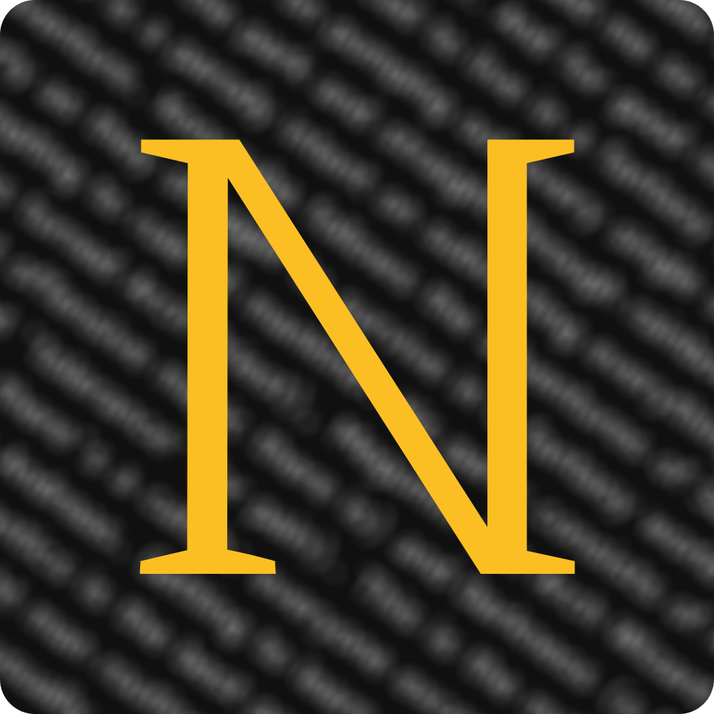

 

# *Notetxt*

A minimalistic note-taker app designed to let you jot down what you need with ease, without distractions — <strong>no accounts, no subscriptions</strong>, just you and your notes.

[**Open website →**](https://notetxt.xyz)

## ✨ Features

- Manage multiple notes in the [Note Manager](https://notetxt.xyz/editor?manager=open)
- Support for `.txt` and `.md` files
- Drag/drop or open existing files in the Editor
- Preview your notes in [Markdown](https://docs.notetxt.xyz/main/markdown)
- Retrieve the last note you were working on
- Download notes to your computer
- View various metrics about your notes
- Use [slash commands](https://docs.notetxt.xyz/main/slash-commands) to auto-insert Markdown syntax

## 📚 Documentation

To learn how to use Notetxt and its various other features, visit the [documentation](https://docs.notetxt.xyz).

## License

© **2024** - Notetxt is licensed under the [MIT License](LICENSE).